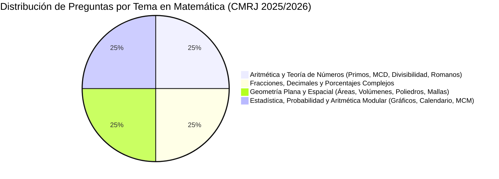

# Análisis Profundo del Examen de Matemática - Colégio Militar do Rio de Janeiro (CMRJ)
**Proceso Seletivo de Admissão ao 6º Ano do Ensino Fundamental 2025/2026**
*Exame Intelectual aplicado el 19 de Octubre de 2025*

---

## 1. Resumen Ejecutivo y Ficha Técnica de la Prueba

El **Exame Intelectual do Colégio Militar do Rio de Janeiro (CMRJ)** para el ingreso al **6º Año de Enseñanza Fundamental (2025/2026)** representa uno de los exámenes de admisión más exigentes e integradores a nivel nacional en Brasil para alumnos de 10 a 11 años de edad.

### Ficha Técnica
* **Institución:** Colégio Militar do Rio de Janeiro (DEPA / DECEx - Exército Brasileiro).
* **Nivel de Ingreso:** 6º Año del Ensino Fundamental (Educación Primaria Alta / Secundaria Inicial).
* **Fecha de Aplicación:** 19 de Octubre de 2025.
* **Tiempo Total de Prueba:** 4 horas y 30 minutos (incluye 20 preguntas de Matemática, 20 preguntas de Lengua Portuguesa y 1 Producción Textual / Redacción).
* **Estructura de la Sección de Matemática:** 20 preguntas objetivas de opción múltiple con 5 alternativas (A, B, C, D, E).

---

## 2. Análisis Matricial Pregunta por Pregunta

A continuación se detalla la caracterización completa de las 20 preguntas de Matemática contenidas en la prueba:

| Q# | Tema Principal | Subtemas Evaluados | Tipo de Pregunta / Habilidad Cognitiva | Nivel de Profundidad / Dificultad |
|---|---|---|---|---|
| **01** | Estadística Descriptiva | Interpretación de gráficos de barras dobles, media aritmética, análisis de enunciados. | **Análisis de Datos y Verificación:** Evaluar 4 afirmaciones combinando media con decimales y diferencias diarias. | **Medio** (Exige rigor en lectura de gráficos y cálculos con decimales). |
| **02** | Sistema Métrico Decimal | Conversión de unidades de longitud ($cm, hm, km, mm, dm$), suma de decimales. | **Conversión y Cálculo Multi-unidad:** Convertir 5 distancias en distintas unidades a una unidad común y comparar respuestas. | **Medio-Alto** (Trampa de atención con ceros y factores de conversión $10^n$). |
| **03** | Fracciones y Financiera | Fracción de una cantidad, operaciones con monedas/sistema monetario, cálculo de faltante/vuelto. | **Problema Multietapa en Contexto Real:** Fraccionar 360 monedas en 4 valores monetarios, sumar saldo previo y evaluar costo. | **Medio-Alto** (Cadena operacional de 5 pasos aritméticos). |
| **04** | Racionales y Porcentajes | Suma de fracciones, porcentaje del remanente, ecuaciones implícitas. | **Abstracción Proporcional Inversa:** Hallar el salario total a partir del 20% del remanente fraccionario ( $\frac{7}{120}$ del total). | **Difícil** (Requiere razonamiento algebraico sin usar álgebra explícita). |
| **05** | Geometría 3D y Divisibilidad | Razonamiento espacial en cubo $3\times3\times3$, extracción de bloques, fracciones y criterios de divisibilidad. | **Integración Geométrico-Aritmética:** Determinar cubos extraídos en 3 ejes ortogonales ($m=7, n=20$), calcular $100 \times \frac{m}{n}$ y probar divisibilidad. | **Difícil** (Visualización espacial tridimensional + teoría de números). |
| **06** | Sistema Posicional y Números Romanos | Valor posicional de dígitos, sistemas de ecuaciones con dígitos, conversión a números romanos. | **Cálculo Deductivo y Conversión Histórica:** Deducir número de 4 dígitos $M=2358$, calcular la mitad ($1179$) y transformar a $MCLXXIX$. | **Difícil** (Criptoaritmética básica + cálculo romano). |
| **07** | Geometría Espacial | Planificación (desarrollo plano) de un cubo, orientación de sombras de caras. | **Visualización y Rotación Espacial:** Identificar cuál cubo tridimensional plegado corresponde al plano 2D desplegado. | **Medio-Alto** (Evaluación de rotación mental 3D). |
| **08** | Probabilidad y Teoría de Números | Probabilidad clásica ($P = \frac{n}{N}$), criterio de primalidad para números de 3 dígitos. | **Discriminación de Números Primos:** Analizar 8 números de 3 dígitos (ej. 109, 161, 221, 251, 263, 343, 637, 869) para identificar los primos. | **Muy Difícil** (Las trampas 161=$7\times23$ y 221=$13\times17$ desorientan al alumno no entrenado). |
| **09** | Geometría de Poliedros | Elementos de sólidos geométricos (Caras, Vértices, Aristas de prismas triangular, pentagonal y hexagonal). | **Conteo de Elementos Poliedrales:** Aplicar o calcular $V+F+A$ para tres prismas distintos y sumar el total ($90$). | **Medio** (Requiere conocimiento claro de fórmulas de prismas). |
| **10** | Geometría, Volúmenes y Logística | Volumen de paralelepípedo, capacidad ($m^3 \to \text{litros}$), porcentaje, tarifado comercial por tramos. | **Problema Logístico Realista Complejo:** Determinar capacidad útil (90%), número de viajes, tramo excedente en km y costo total tarifado. | **Muy Difícil** (Múltiples variables comerciales, redondeo de km por exceso y conversiones). |
| **11** | Aritmética Periódica y Calendario | Mínimo Común Múltiplo ($MCM$), ciclos de trabajo/descanso, cómputo de días en el calendario. | **Sincronización Periódica de Eventos:** $MCM(6, 7, 8) = 168$ días. Proyectar fechas exactas a partir del 9 de enero en 2025. | **Difícil** (MCM + contabilidad exacta de días en meses de 28, 30 y 31 días). |
| **12** | Fracciones, Porcentajes y Proporciones | Porcentajes del total, fracciones irreducibles, suma de términos $N+D$. | **Interpretación Poblacional:** Calcular cantidades de 7 grupos en una reunión de 600 personas, construir la fracción $M = \frac{220}{380} = \frac{11}{19}$ y sumar $11+19$. | **Medio-Alto** (Procesamiento sistemático de datos proporcionales). |
| **13** | Aritmética Modular y Calendario | Años bisiestos (regla de múltiplos de 4), desfase de días de la semana (módulo 7). | **Proyección Modular Temporal:** Calcular el día de la semana tras 7 años (incluyendo 2 bisiestos: 2028 y 2032), resultando en $+9 \equiv +2 \pmod 7$. | **Difícil** (Exige comprender cómo la bisiestidad afecta el ciclo semanal). |
| **14** | Promedios Aritméticos Anidados | Promedio ponderado/aritmético por trimestres, enmascaramiento simbólico de variables. | **Álgebra Simbólica con Promedios:** Resolver un sistema de ecuaciones donde notas desconocidas están representadas por iconos (Estrella, Carita, Corazón). | **Difícil** (Resolución de sistema de 3 ecuaciones de promedio entrelazadas). |
| **15** | Teoría de Números (MCD/MDC) | Máximo Común Divisor ($MCD$), distribución equitativa de insumos. | **Distribución Máxima Equitativa:** Hallar $MCD(728, 1183, 819) = 91$ y determinar las sillas blancas + azules por aula ($8+9=17$). | **Difícil** (Factorización en primos "difíciles" como el 7 y el 13). |
| **16** | Geometría Plana en Mallas | Perímetro de polígonos sobre grilla rectangular, sistema de ecuaciones implícito. | **Geometría de Mallas:** Relacionar lados de rectángulos de la malla $(x, y)$ con perímetros de figuras $C, R, J$ para deducir el perímetro de $M$. | **Difícil** (Invariantes geométricas en cuadrículas). |
| **17** | Geometría Plana y Áreas | Área de rectángulos compuestos, proporciones entre dimensiones ($C = 3L$), conversión de unidades ($dm^2, dm, cm, m$). | **Modelado Geométrico Cuadrático:** Formar rectángulo de $540\text{ dm}^2$ con 5 toallas idénticas, resolver $15L^2 = 540 \implies L=6\text{ dm}, C=18\text{ dm} = 0,6\text{ m} / 18\text{ dm}$. | **Difícil** (Relación dimensional implícita + conversión). |
| **18** | Geometría, Rendimiento y Presupuesto | Área en mallas de azulejos, rendimiento por capa de pintura, redondeo por exceso (techo), costo. | **Presupuesto y Pintura en Malla:** Calcular área de figura por polígonos, aplicar 2 capas, calcular número entero de latas requeridas por color y costo total. | **Difícil** (Cálculo espacial + función techo de compras reales). |
| **19** | Operaciones Operacionales Complejas | Fracciones continuas/anidadas, jerarquía estricta de operaciones de números racionales. | **Resistencia y Rigor Aritmético:** Resolver una expresión racional masiva con fracciones anidadas en 4 niveles de profundidad. | **Muy Difícil** (Evaluación de técnica operativa pura y tolerancia al error). |
| **20** | Potencias de 10 y Abstracción Decimal | Multiplicación/División por $10^n$, $0,1$, $0,01$, simplificación de expresiones algebraico-decimales. | **Estructura Decimal en Cadena:** Aplicar transformaciones decimales cíclicas y cancelar términos algebraicos para simplificar la expresión a $1-D$. | **Difícil** (Comprensión profunda del valor posicional en base 10). |

---

## 3. Distribución por Áreas Temáticas

1. **Aritmética y Teoría de Números (25% - 5 preguntas):**
   - Preguntas: 06 (Dígitos y Romanos), 08 (Números Primos), 15 (MCD/MDC), 05 (Divisibilidad), 20 (Decimales/Potencias de 10).
2. **Fracciones, Decimales, Porcentajes y Promedios (25% - 5 preguntas):**
   - Preguntas: 03 (Fracciones monetarias), 04 (Remanente fraccionario e inverso), 12 (Porcentajes y fracciones irreducibles), 14 (Promedios simbólicos anidados), 19 (Fracciones continuas complejas).
3. **Geometría Plana, Espacial y Mediciones (25% - 5 preguntas):**
   - Preguntas: 05 (Cubo 3D perforado), 07 (Plegado de cubo 2D/3D), 09 (Elementos de prismas), 16 (Perímetros en mallas), 17 (Áreas rectangulares compuestas).
4. **Magnitudes, Logística, Probabilidad y Métodos Temporales (25% - 5 preguntas):**
   - Preguntas: 01 (Estadística / Gráficos), 02 (Sistema Métrico Decimal), 10 (Volumen/Capacidad/Transporte comercial), 11 (MCM / Períodos de trabajo), 13 (Años bisiestos / Módulo 7).

---

## 4. Análisis del Tipo de Preguntas y Estilo Pedagógico

Las preguntas de la prueba del Colégio Militar no son meros ejercicios procedimentales directos. Tienen características distintivas:

### A. Contextualización Narrativa "Storytelling" y Elementos Militares
* Se utilizan escenarios reales de la vida de los alumnos del CMRJ, como competiciones de carrera (Mariana, Q02), ahorro para regalos (Tito, Q03), salas de clase del colegio (Q15), experimentos en laboratorios de matemáticas (Q09), escalas de trabajo de egresadas (Q11), o presupuestos de pintura y logística de carga (Q10, Q18).
* Este enfoque exige que el alumno primero **lea, comprenda y traduzca un texto narrativo en un modelo matemático**.

### B. Estructura Multietapa (Multi-step Problem Solving)
Ninguna pregunta se resuelve en un solo paso. Por ejemplo, en la **Pregunta 10** (Transporte de entulho):
1. Calcular volumen en $m^3$ a partir de dimensiones en metros y decímetros ($4 \times 2,5 \times 2 = 20\text{ m}^3$).
2. Convertir $m^3$ a litros ($20.000\text{ L}$).
3. Aplicar restricción de seguridad (90% de capacidad = $18.000\text{ L}$).
4. Determinar número de viajes ($72.000 / 18.000 = 4\text{ viajes}$).
5. Convertir distancia ($22.400\text{ m} = 22,4\text{ km}$).
6. Aplicar regla comercial de redondeo por exceso para tramos ($22,4\text{ km} \to \text{exceso de } 2,4\text{ km} \implies 3\text{ km}$ cobrados).
7. Calcular precio por viaje ($\text{R\$ } 750 + 3 \times \text{R\$ } 50 = \text{R\$ } 900$).
8. Multiplicar por número de viajes ($4 \times 900 = \text{R\$ } 3.600,00$).

### C. Integración Temática Cruzada
La prueba evalúa intencionalmente la intersección de distintos campos matemáticos dentro de un mismo ítem:
* **Q05:** Geometría espacial 3D + Fracciones + Criterios de Divisibilidad / Múltiplos.
* **Q08:** Probabilidad Clásica + Identificación de Números Primos de 3 dígitos.
* **Q14:** Sistemas de Ecuaciones + Promedios Aritméticos Trimestrales + Reemplazo Simbólico.
* **Q17:** Geometría Plana + Álgebra Básica de Superficies + Conversión de Unidades.

---

## 5. Nivel de Profundidad Cognitiva y Nivel de Exigencia

### Evaluación según la Taxonomía de Bloom
* **Conocimiento y Comprensión (10%):** Identificación de elementos en prismas (Q09) o lectura básica de gráficos (Q01).
* **Aplicación (30%):** Conversión del sistema métrico (Q02), cálculo de MCD clásico (Q15), operaciones con potencias de 10 (Q20).
* **Análisis y Síntesis (60%):** Modelado algebraico implícito (Q04, Q14), deducción lógica de dígitos (Q06), razonamiento modular de calendarios y MCM (Q11, Q13), optimización y presupuestos en mallas (Q16, Q18).

### Trampas Frecuentes y "Gotchas" en la Prueba
1. **Factores de Conversión y Ceros:** En la Q02 se combinan $cm, hm, km, mm, dm$, forzando conversiones rigurosas donde un cero desplazado arruina el resultado.
2. **Falsos Primos:** En la Q08, números como $161$ ($7 \times 23$), $221$ ($13 \times 17$) y $637$ ($7^2 \times 13$) parecen primos a simple vista, requiriendo que el alumno sepa aplicar el test de divisibilidad hasta $\sqrt{N}$.
3. **Reglas de Redondeo en la Vida Real:** En la Q10 y Q18, las reglas de negocio exigen redondeo por exceso (comprar latas enteras de pintura o pagar km completos por fracción). Si el alumno usa decimales continuos, marca un distractor incorrecto.
4. **Resistencia en Fracciones Continuas:** La Q19 pone a prueba la serenidad y la precisión operacional bajo presión de tiempo con fracciones superpuestas de 4 niveles.

---

## 6. Conclusiones y Diagnóstico Pedagógico

La sección de Matemática del examen de admisión al 6º Año del Colégio Militar do Rio de Janeiro (CMRJ 2025/2026) **posee un nivel de profundidad comparable a Olimpiadas de Matemática (nivel de entrada / OBMEP)** combinado con problemas contextualizados de la vida real.

### Perfil del Estudiante Exitoso para este Examen:
1. **Dominio Completo de la Aritmética Fundamental:** Manejo fluido de números primos, MCD, MCM, fracciones anidadas y decimales sin uso de calculadora.
2. **Pensamiento Geométrico y Espacial Desarrollado:** Capacidad de visualizar objetos tridimensionales a partir de planos 2D y analizar figuras compuestas sobre cuadrículas.
3. **Comprensión Lectora y Traducción al Lenguaje Matemático:** Destreza para descomponer enunciados largos en ecuaciones o esquemas paso a paso.
4. **Atención al Detalle y Cero Margen de Descuido:** Rigor absoluto en unidades de medida ($m, dm, cm, mm, L, m^3$) y reglas contextuales.

---
*Reporte generado automáticamente para análisis de contenidos del Colégio Militar.*
