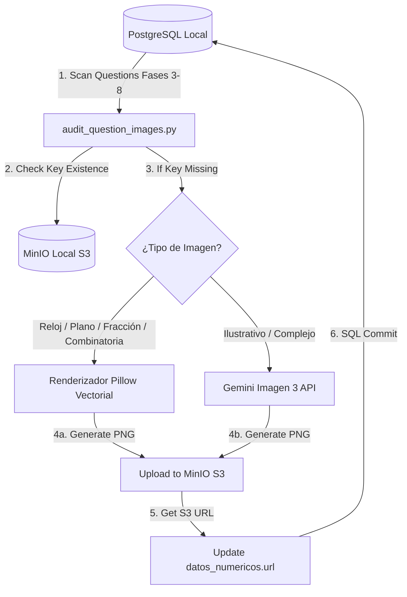

# Especificación Técnica de Diseño: Autocuración de Imágenes

Este documento detalla la arquitectura de software y el pipeline de procesamiento offline diseñado para inicializar y autocurar el material gráfico del banco de preguntas en el entorno local.

---

## 📐 Flujo Arquitectónico de Autocuración

---

## 🛠️ Detalle de Componentes y Algoritmos

### 1. El Script Diagnóstico (`audit_question_images.py`)
El script actúa como el orquestador principal. Corre asíncronamente conectándose a PostgreSQL a través del motor SQLAlchemy de la aplicación (`AsyncSessionLocal`) y al cliente boto3 S3 de `storage_service`.

### 2. Pipeline de Renderizado Vectorial (Pillow)
Para garantizar gráficos limpios y geométricamente perfectos, el script implementa funciones de dibujo offline personalizadas:
* **Relojes Trigonométricos**:
  * Utiliza coordenadas polares para calcular el ángulo exacto de las manecillas:
    * Manecilla de minutos: $\theta_{min} = 90^\circ - (minutos \times 6^\circ)$
    * Manecilla de horas: $\theta_{hora} = 90^\circ - (hora \times 30^\circ) - (minutos \times 0.5^\circ)$
  * Dibuja círculos concéntricos, marcas minuteras, números grandes y legibles, y manecillas diferenciadas por grosor y longitud.
* **Plano Cartesiano**:
  * Dibuja ejes X e Y centrados con flechas terminales.
  * Renderiza grillas punteadas grises de fondo.
  * Grafica puntos marcados, líneas o polígonos rellenos translúcidos con coordenadas rotuladas.
* **Círculos y Barras de Fracciones**:
  * **Círculo**: Utiliza `draw.pieslice` con arcos trigonométricos para sombrear la cantidad exacta de partes que representa el numerador sobre el denominador (ej. $3/4 \to 270^\circ$).
  * **Barra**: Dibuja una caja rectangular subdividida uniformemente en $N$ rectángulos, aplicando un fondo de color vivo (ej. Celeste Pastel) a los primeros $M$ elementos.
* **Combinatoria y Probabilidad (Dados y Urnas)**:
  * **Dados**: Dibuja cubos con esquinas redondeadas y el patrón de puntos (pip) de la cara indicada.
  * **Urnas**: Dibuja un frasco o contenedor con transparencia y esferas de colores (rojo, azul, verde, amarillo) distribuidas en base al enunciado.

### 3. Generación Asistida por IA (Gemini Imagen 3)
Si la pregunta requiere una ilustración conceptual y se detecta una API Key válida en el entorno, el script:
1. Diseña un prompt descriptivo detallado (ej: *"A simple educational thermometer indicating 35 degrees Celsius, flat vectors for kids, isolated on white background"*).
2. Llama a la API de generación de imágenes de Google Gemini.
3. Convierte el payload base64 a archivo binario.

### 4. Persistencia y Fallbacks
* **Subida a MinIO**: La imagen se almacena en el bucket `logicakids` bajo la ruta `graphics/{pregunta_uuid}.png`.
* **Fallback a disco**: Si el storage S3 local reporta fallas o desconexión, el script guarda la imagen en `backend/app/static/graphics/{pregunta_uuid}.png` para que sea servida de manera local por el framework FastAPI de forma transparente.
* **Actualización en Base de Datos**: Actualiza el campo `datos_numericos` de la pregunta agregando o reemplazando la clave `"url"` por el endpoint expuesto de la imagen.

---

## 🧪 Plan de Verificación Técnica

1. **Simulación y Mockeo de API Keys**:
   - Comprobar que el script corra correctamente usando fallbacks vectoriales si no se proveen credenciales de Gemini, sin arrojar excepciones.
2. **Validación de Carga HTTP**:
   - Probar que los URLs inyectados en la base de datos comiencen con la ruta correcta del bucket de MinIO local (`http://localhost:9000/logicakids/...`) o el path estático.
